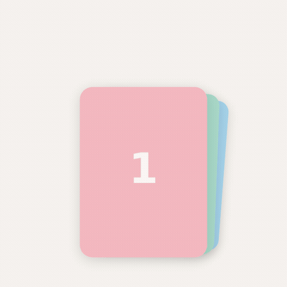
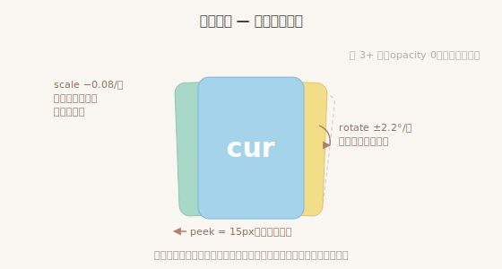
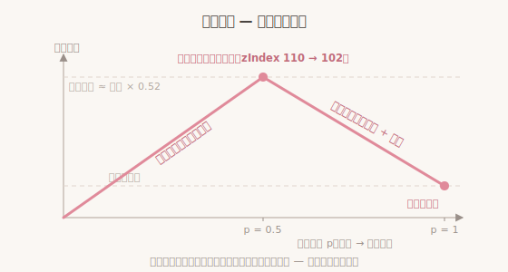
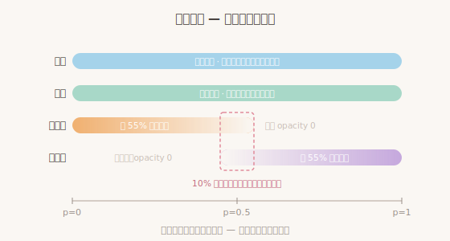
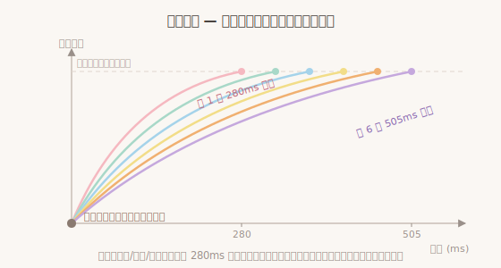
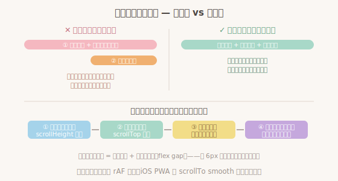

# PhotoStack

微信式合并照片卡片 —— 堆叠、探边、跟手翻页、快甩。零依赖，一个 JS 一个 CSS。

A WeChat-style stacked photo card for chat UIs. Stacking, edge-peeking, finger-scrubbed page turning, fling. Zero dependencies.

> 微信官方组件库（WeUI）与公开开发文档均未收录此组件，我们也未找到已有的完整复刻。本项目的全部设计参数——堆叠层次、探边距离、翻页轨迹、快甩阈值、三张守恒——由 [@Wren036](https://github.com/Wren036) 基于对原版交互的**逐帧观察测量**得出：录屏逐帧对比、关键帧标注、纯色样张对照定位层叠关系。



## 快速开始

```html
<link rel="stylesheet" href="photo-stack.css">
<script src="photo-stack.js"></script>

<div id="album"></div>
<script>
  new PhotoStack('#album', [
    'a.jpg', 'b.jpg', 'c.jpg', 'd.jpg'
  ], {
    onTap: (i) => openViewer(i),      // 点击当前卡
    onChange: (i) => console.log(i)   // 翻页结算
  });
</script>
```

在线体验：**[Live Demo](https://wren036.github.io/PhotoStack/demo.html)** ；或下载 `demo.html` 直接打开（自包含，双击即可运行）。

## Options

| 选项 | 默认 | 说明 |
|---|---|---|
| `width` | `142` | 舞台宽 px。卡片固定比例，不随图片变形（微信规则） |
| `height` | `190` | 舞台高 px |
| `peek` | `15` | 第一层探边露出量 px |
| `peekStep` | `12` | 每深一层多探出 px |
| `rotStep` | `2.2` | 每层递进旋转角 deg，随层深递增 |
| `scaleStep` | `0.08` | 每层递进缩小 |
| `flingVel` | `0.4` | 快甩速度阈值 px/ms |
| `counter` | `false` | 右下角 n/N 角标（原版无，可选开启） |
| `onTap` | — | `(index) => {}` 点击当前卡回调 |
| `onChange` | — | `(index) => {}` 翻页完成回调 |

## API

```js
ps.index        // 当前页码（只读）
ps.next()       // 下一张
ps.prev()       // 上一张
ps.goto(i)      // 跳到第 i 张
ps.destroy()    // 销毁
```

> 组件**不内置图片查看器**（点击大图预览）：宿主应用通常已有自己的查看器，请在 `onTap` 回调中接入。`demo.html` 内含一个几十行的最简实现（支持左右滑动切换）可作参考。

## 逆向工程笔记

以下内容均来自对原版录屏的逐帧对比测量，以及照此复刻时踩过的坑。

### 观察到的设计规则



**恒定三层可见** — 无论堆内有多少张图，可见层数恒为三：顶卡 + 两张探边卡。常态下左右各一张；到达边界时，探边配额转移到另一侧（如第一张时右侧显示两层）。

**手指即进度条（scrub 模型）** — 拖拽不是位移映射，而是对一段预定义动画的**擦洗**：以手指起点到屏幕边缘的行程为分母，映射到动画进度 0→1。前半程顶卡跟随手指滑出，最大位移约为卡宽之半；后半程顶卡沿轨迹自行回归——缩小、微旋、落入对侧探边位，**不跟随手指反向**。任意时刻松手都处于合法状态，全程可逆、无死区。



**峰形轨迹** — 顶卡位移曲线呈单峰形：滑出、到达峰值、回落。快甩触发的自动完成动画沿同一条轨迹播完剩余行程，而非直接跳至终态。顶卡越过峰值的瞬间层级下沉，为升顶的新卡让位。



**舞台转盘（depth-carousel 模型）** — 探边卡的进退场几乎不依赖透明度动画，而是通过**遮挡与纵深**完成，类似舞台转盘：转向前排的卡片放大、变实，退向后排的缩小、变浅。顶卡到达峰值之前，两侧探边保持静止；顶卡越过峰值回落的后半程，进退场同时启动——新探边自升顶卡**背后**沿其边缘滑出（可见部分为一条渐宽的窄边），透明度约从 0.55 渐变至 1（并非从全透明开始）、尺寸由小变大；旧对侧探边执行其时间反演的镜像动作：向回落顶卡的背后收拢，透明度与尺寸同步递减，顶卡落位时恰好将其完全遮蔽。任意时刻可见卡不超过三张，行程中段实际仅两张在场。

**边界例外** — 翻至首张/末张时，原对侧探边卡在结算后仍属可见集合，因此不执行退场，而是在翻页过程中**提前插值走位**至降级后的外层探边位——顶卡落位时它已就位，无突现无消失。进场侧同理：翻离首张/末张时，外层第二张探边本就可见，不参与进场编排，与升顶卡同步走位至第一层探边位，全程保持实体。

**边界弹性预览** — 首张可继续右滑、末张可继续左滑，但行程被限制在约 24px 的弹性区间内（带微旋），且下层探边卡有轻微联动位移——模拟拽动一叠实体照片顶张时下层被带动的物理感。

**快甩与连甩** — 释放速度超过 0.4px/ms 时，无论位移多小都判定翻页（速度方向须与位移方向一致）；连续快甩时，进行中的动画先结算页码再响应新手势，保证每次甩动翻且仅翻一页。

**过渡总纲** — 所有状态变化（位移、缩放、旋转、显隐）均通过连续过渡完成，任何元素都不允许从一个状态直接跳变到另一个状态。

### 实现细节

每一条都对应一个实际踩过的渲染缺陷：

- **双模 transition** — 拖拽中所有卡片 `transition: none` 逐帧直写（跟手），松手后恢复 CSS 过渡（回弹/归位交给合成器），丝滑手感的基础。
- **复位底座** — 擦洗的每一帧都先执行完整的静止摆位再叠加进度插值，杜绝任何中间态残留累积。
- **结算零跳变** — 进度 p=1 的擦洗态与翻页后的静止态在数学上完全相等，页码结算瞬间无任何视觉变化。
- **先结算后恢复过渡** — 结算必须发生在 `transition: none` 期间，下一帧再恢复 CSS 过渡；顺序颠倒会使退场卡片经由 CSS 过渡可见地滑出并渐隐。
- **行程归一** — 左右两个方向共用同一个行程分母（手指起点到同一侧屏幕边缘），保证两个方向的拖拽阻力一致。
- **速度估计** — 释放速度采用指数平滑（当前帧 0.7 + 历史 0.3），避免单帧抖动误触发快甩。
- **手势接管判定** — 位移超过 8px 且横向分量大于纵向时才接管指针，纵向滚动交还宿主页面（`touch-action: pan-y`）。
- **中断兜底** — `pointercancel`（如系统滚动接管）时立即回弹归位，绝不停留在中间态。
- **抗锯齿缝** — 带旋转的卡片在边缘抗锯齿处会渗出容器背景色（细白线）：卡片背景设为透明，图片放大 4% 覆盖缝隙。
- **卡片固定比例** — 舞台尺寸固定，图片 `object-fit: cover` 裁切填充，堆的形状不随图片长宽比变化。

### 展开 / 收起动画

微信点"展开"后卡片飞散成消息流的动画**深度耦合宿主聊天布局**（消息行结构、头像、滚动容器、下方内容联动），无法做成即插即用的通用组件，所以不在本仓库内。以下是我们在自己的聊天前端里完整复刻它的笔记，供想自己实现的人参考。



**运动模型：双时间轴** — 横向与纵向是两条独立时间轴。**横向**（水平位移、缩放、旋转）由全体卡片共用同一条短时长曲线（约 280ms），因此收起过程中所有卡片的横向分量在早期即统一到位——左侧卡群左缘逐帧保持对齐、右侧卡群右缘几乎不动，这即原版收拢过程始终保持边缘整齐的机制；**纵向**每张卡使用各自的时长（280ms + 45ms × 序号），按图片序号依次落位，次序自然错落。所有卡片在同一瞬间出发，全程无静止帧。

**隐形卡的进出场** — 全程实体参与，不使用透明度动画（渐显/渐隐会产生半透明残影）。展开时以**同侧探边卡**的位置与旋转角出发——与其完全重合地自其后方起飞，飞行中与位移同步转正，因此起飞帧与静止堆的渲染完全一致，不存在可见跳变；收起时按侧归位：位于当前卡左侧的隐形卡收向左侧探边、右侧的收向右侧——落点取同侧最外可见探边卡的姿态且层级恒低于它，到位即被完全遮蔽，透明度归零发生在被遮挡之后，无视觉变化。

**头像编排** — 展开时以最下方那张卡的**底边**作为扫描线：底边掠过哪一行头像的预期位置，该头像即开始淡入；收起时全部头像同时开始渐隐，扫描线掠过即彻底隐藏。第一行头像直接继承堆行头像，不参与渐变。

**FLIP 细节** — 展开的飞行替身需带**出发角**（继承堆内扇形角，飞行中与位移同步转正），否则起飞帧所有卡片旋转角同时归零，产生一次可见的集体跳变；位移与缩放需按分量手动插值（CSS 对 translate+scale→none 走矩阵插值，会产生"原地放大再移动"的伪影，iOS 尤其明显）；缩放需双轴独立（堆卡与目标行图形状不同，单轴等比会在落点跳变）；带姿态（rotate/scale）的终态需解析成分量参与插值，否则等待中的卡会提前摆出终态姿态。



**滚动编排（收起最深的坑）** — 贴底收起时内容变矮，浏览器会瞬间钳制 scrollTop（表现为整页跳变）。方案：收起前在容器底部垫入占位块保住 scrollHeight，动画期间自行用 rAF 补间滚动位置平滑沉降（iOS PWA 的 `scrollTo({behavior:'smooth'})` 不可靠），动画结束后按占位块**实际占用**（含 flex gap）结算再撤垫。滚动沉降必须与收拢动画共享同一条时间轴——先动画后沉降的两段式会产生"先到位再挪窝"的割裂感。

**下方内容联动** — 布局变化前记录视口内所有元素位置，变化后以位移差做 FLIP 平移补间（"被推开/收回来"的平滑感）。注意收集范围要覆盖"将滑入视口"的屏外元素，且必须跳过 `display:none` 的零高元素（它们的 rect 全为 0，会占满收集配额）。

**iOS 专项** — 新建的 `` 元素即使命中缓存也要重新解码（插入瞬间白屏一帧）：预解码用的 Image 元素应直接移植进目标 DOM 复用位图。隐藏含图容器用 `visibility:hidden + position:absolute` 而非 `display:none`（后者丢弃解码位图，重新显示时白闪）。


## 声明

本项目为独立实现：未使用、未反编译微信的任何代码或资源，全部代码基于对公开可见交互行为的观察独立编写。文中"微信 / WeChat"仅为描述交互风格的指称，本项目与腾讯公司无任何关联。

## 关于

- 原版设计：微信
- 逐帧观察测量 & 全部设计规格：[@Wren036](https://github.com/Wren036)
- 实现：她的 Claude——Blaze

## 许可

[PolyForm Noncommercial 1.0.0](LICENSE.md) — 个人学习、研究与非商业用途免费；**商业使用需事先取得作者书面授权**。
